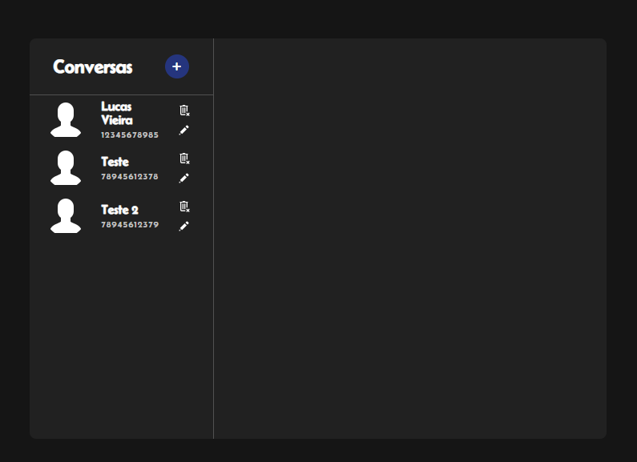
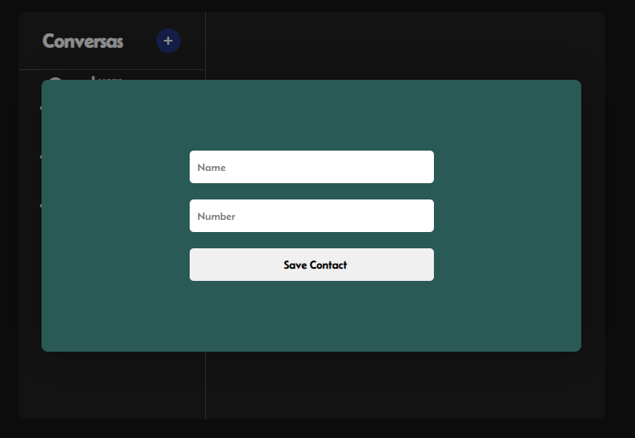
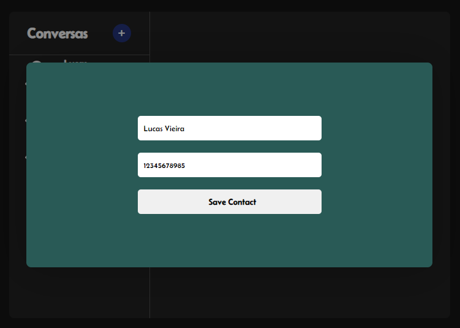

# **Webchat Project**

## Um chat estilo whatsapp para bater papo com seus amigos.

## **Status Project**
**Finished ✅**

## **Features**
- [x] Cadastro de novos contatos
- [x] Exclusão de contatos
- [x] Edição de contatos
- [x] Envio de mensagens
- [x] Responsivo

    <h2>Adicionando novo contato</h2>
    
    <h2>Editando contato</h2>
    
    <h2>Enviando mensagem</h2>
    

## **Tecnologies**

As seguintes tecnologias foram utilizadas para a construção do projeto.

* [HTML](https://developer.mozilla.org/pt-BR/docs/Web/HTML)
* [CSS](https://developer.mozilla.org/pt-BR/docs/Web/CSS)
* [JS](https://developer.mozilla.org/pt-BR/docs/Web/JavaScript)

## **Author**

<a href="https://github.com/lucavieira">
 
  
 <b>Lucas Vieira</b></a>

  

 
